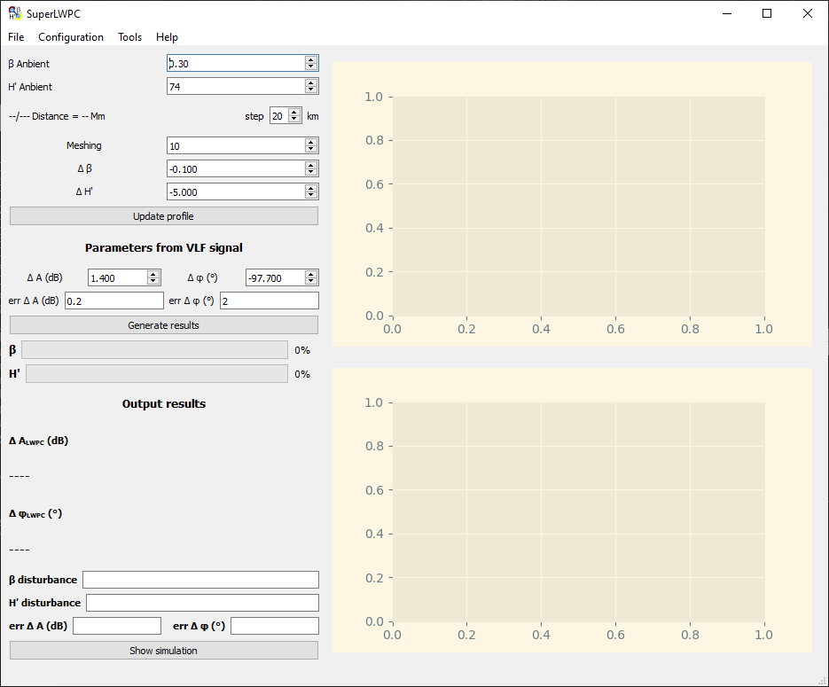
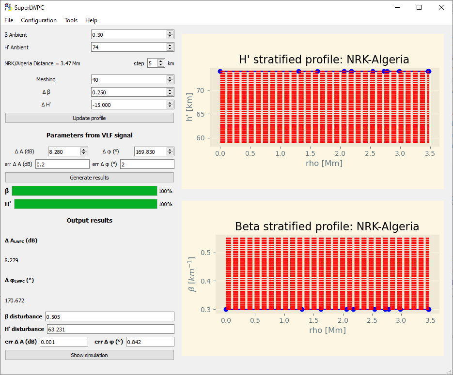
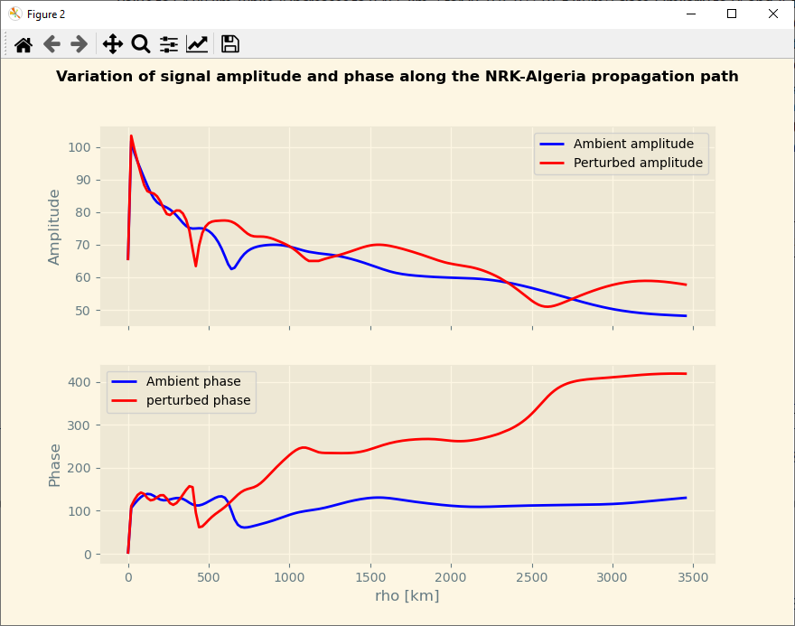

# SuperLWPC
## Description
The LWPCv21 code is a set of programs that can be used according to the user's needs. The determination of the coefficients *H'* and *𝛽* is done interactively during which we seek to minimize the deviation between the measured ELF/VLF/LF signal perturbations and the introduced model. This procedure is very time-consuming and tedious to perform because the LWPC code as is requires running multiple executables with each adjustment made and at the end of each iteration. For this reason, we decided to develop a SuperLWPC interfaced application that allows to run a set of tests in an interactive and autonomous way. This application was developed using the Python programming language.

A graphical user interface "SuperLWPC" is very useful to: save time, accuracy and avoid any manual change of the LWPC code entries. This approach minimizes the causes of errors that can occur when changing input parameters of a program that need to be generalized to all input files for other subprograms.

 
## Download executable version
* [SuperLWPC_Win64-Bit.zip](https://drive.google.com/file/d/1HUD6Yr8j0lZ-z1PjANGDMrRN447xpWfn/view?usp=share_link) (328 Mo)
* SuperLWPC_Linux64-Bit(x86).zip (297 Mo)

## User Guide
1. Run the file **SuperLWPC.exe** (under window or **./SuperLWPC** under linux). The interface will appear with a console window for debugging mode.
2. The main window of the application will appear on the screen.

3. In the menu bar, go to *Configuration/LWPC* input or type on the keyboard the shortcut **<Ctrl+I>** the LWPC Input Generator window will appear.
4. The **LWPC Input Generator** window contains two tables "gcpath" and "bearings" for the configuration and generation of input files and the creation of output files respectively gcpath.inp/gcpath.log and bearings.inp/bearings.log as well as the configuration of the LWPC software path and the ELF/VLF/LF receiver and transmitter identifiers.

5. Once the **gcpath.log** and **bearings.log** files are created, press the "Update profile" button in the main window and/or change the values of the Meshing, 𝜟𝜷, and 𝜟𝑯′ fields for an estimate of the ionosphere profile following the ionospheric disturbance we are trying to simulate (the values of 𝜟𝜷 and 𝜟𝑯′can be positive or negative.
6. Change the values of 𝛥𝐴 and 𝛥𝜙 depending on what you have on the VLF signal.
7. Press the **Generate results** button to start the simulation.
8. If you did not get the correct values, change one or more parameters from step #5 again.

### Applicaion : SID due to a X6.9 flare on the NRK-Algeria path (Y. Bouderba 2016)

The generated outputs give the set of deviations between measurements and calculations for a set of tests. The figure below shows the outputs obtained with the ℎ′ values on the x-axis and the 𝛽 values tested on the y-axis.

